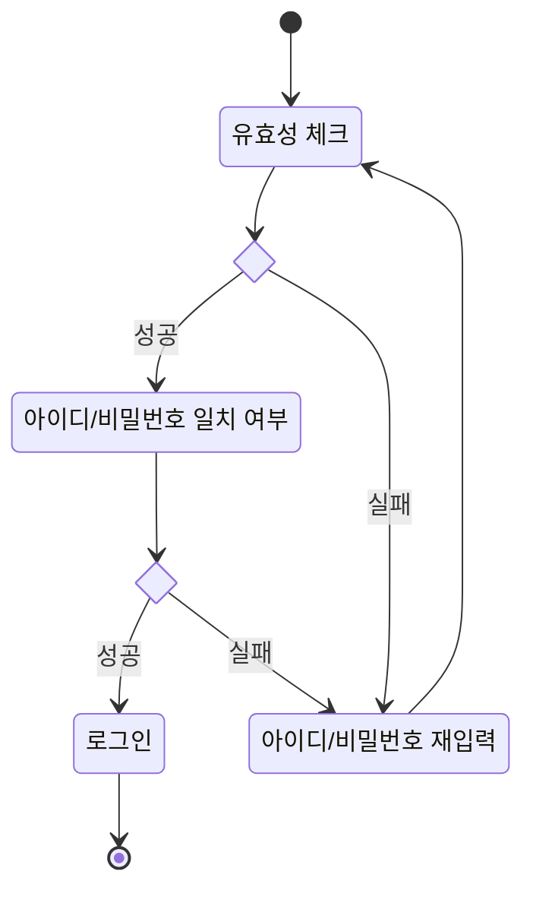
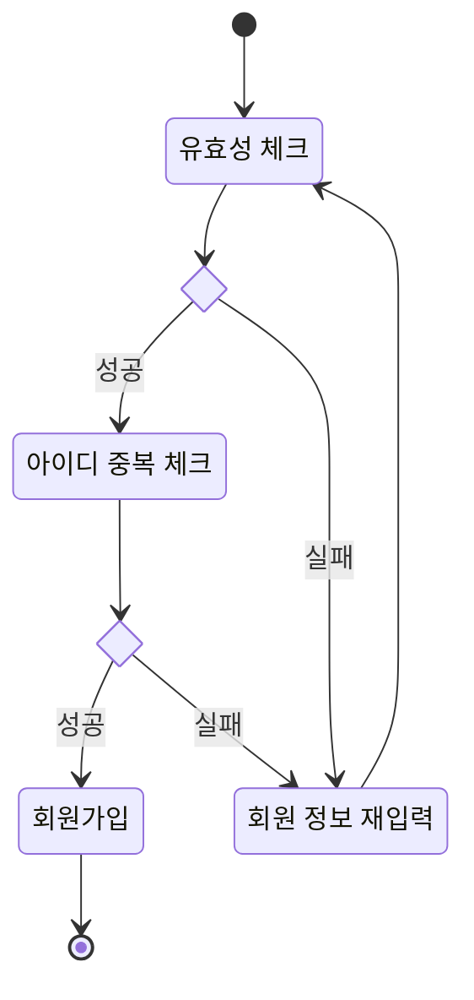
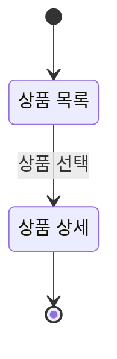
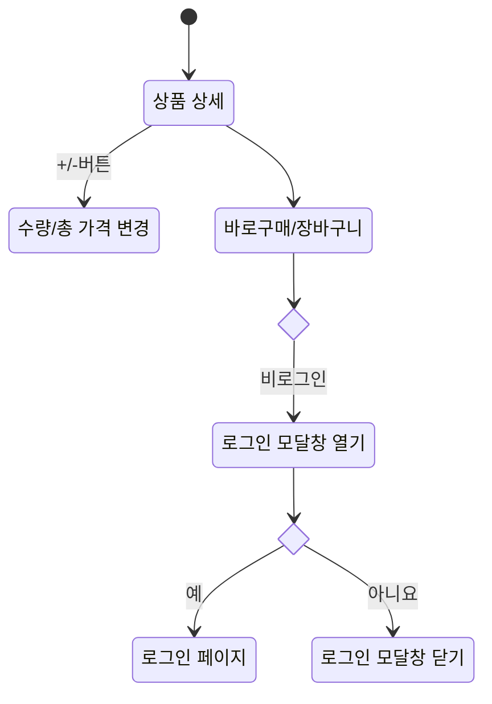

# 감귤 마켓 서비스

## 1. 목표와 기능
### 1.1 목표
- 감귤마켓 서비스
  - 로그인
  - 회원가입
  - 프로필
  - 상품
  - 채팅

### 1.2 기능
- 구매자 로그인
  - /accounts/login/ API 연동 -> 아이디, 비밀번호 일치 여부 확인    
- 구매자 회원가입
  - /accounts/validate-username/ API 연동 -> 아이디 중복 확인
  - /accounts/buyer/signup/ API 연동 -> 회원가입
  - 유효성 검사
- 상품 목록
  - /products/ API 연동 -> 상품 목록 가져오기   
- 상품 상세
  - /products/<int:product_id>/ API 연동 -> 상품 상세 가져오기

## 2. 개발 환경
### 2.1 배포 URL
- <https://github.com/minerkyi/gamgyul-social-market>
- <https://minerkyi.github.io/gamgyul-social-market/>
- 테스트용 계정
  ```
  id : 
  pw : 
  ```
  
### 2.2 연동 API
- [API 명세](https://www.notion.so/oreumi/API-19debaa8982b8129aaa9f8c4678447ac)
- 요청 URL: <https://estapi.mandarin.weniv.co.kr/>

  | URL                          | Note                            |
  |------------------------------|---------------------------------|
  | /accounts/login/             | 로그인 요청하기                   |
  | /accounts/validate-username/ | 아이디 검증하기                   |
  | /accounts/buyer/signup/      | 구매자 계정 만들기                |
  | /products/                   | 상품 전체 불러오기                |
  | /products/<int:product_id>/  | 상품 디테일                      |

## 3. 요구사항 명세와 기능 명세


## 4. 프로젝트 구조
```
open-market
├─ assets
│  ├─ check-box.svg
│  ├─ check-fill-box.svg
│  ├─ icon-check-off.svg
│  ├─ icon-check-on.svg
│  ├─ icon-check.svg
│  ├─ icon-delete.svg
│  ├─ icon-down-arrow.svg
│  ├─ icon-fb.svg
│  ├─ icon-img.png
│  ├─ icon-insta.svg
│  ├─ icon-minus-line.svg
│  ├─ icon-plus-line.svg
│  ├─ icon-plus.svg
│  ├─ icon-rhigt-arrow.svg
│  ├─ icon-search.png
│  ├─ icon-search.svg
│  ├─ icon-shopping-bag.svg
│  ├─ icon-shopping-cart-2.svg
│  ├─ icon-shopping-cart.svg
│  ├─ icon-swiper-1.svg
│  ├─ icon-swiper-2.svg
│  ├─ icon-up-arrow.svg
│  ├─ icon-user-2.svg
│  ├─ icon-user.svg
│  ├─ icon-yt.svg
│  └─ Logo-hodu.png
├─ css
│  ├─ app.css
│  ├─ detail.css
│  ├─ join.css
│  ├─ login.css
│  ├─ product.css
│  └─ reset.css
├─ js
│  ├─ app.js
│  ├─ common.js
│  ├─ detail.js
│  ├─ join.js
│  ├─ login.js
│  └─ product.js
├─ index.html
└─ README.md
```  

 ## 5. 화면 설계
 | 상품 목록  | 상품 상세  |
 |----------|-----------|
 |   |   |
 
 | 로그인  | 회원가입  |
 |----------|-----------|
 |   |   |

## 6. 메인 기능
- 로그인

- 회원가입

- 상품 목록

- 상품 상세

## 7. 개발하며 느낀점
- JavaScript module과 class를 사용하여 프로젝트를 진행하였는데 생각보다 쉽지 않았다.
  수업 시간에 따라 할 때는 그렇게 어렵지 않다고 느꼈는데 실제 처음부터 생성해서 사용하다 보니
  메인과 서브의 구분도 잘되지 않았고 공통으로 잡아야 할 영역도 쉽게 판단되지 않아
  서브에서 메인 내부의 값을 사용해야 하는 경우도 생겼다.
  추후 좀 더 이론적인 부분도 찾아보면서 다양한 예시를 참고해봐야 하겠다.
- SPA로 동작하도록 작업했었는데 새로고침할 때 변경된 URL에서 페이지를 불러올 방법이 마땅히 생각나지 않아
  hash tag를 붙여서 페이지의 변화가 보이도록 진행했다.
  내부 html 코드는 template tag를 사용해서 index.html에 모두 작성하는 방법을 사용했다.
- 이번 프로젝트를 진행하면서 익숙하지 않은 것들을 사용하면서 유용한 내용들을 많이 알게되었다.
  ai를 사용해서 알맞은 정규식을 금방 찾게되었고 GitHub README.md 작성을 위해 마크다운 작성법을 알게되었다.
  백경현 강사님이 샘플로 공유주셨던 GitHub README.md로 양질의 README.md 작성 요령을 알 수 있었다.
  하지만 아직 코드 작성하면서 변수명이나 코드 정리 등이 잘되지 않고 있어 코드 작성 방법을 빨리 바꿔야겠다.
