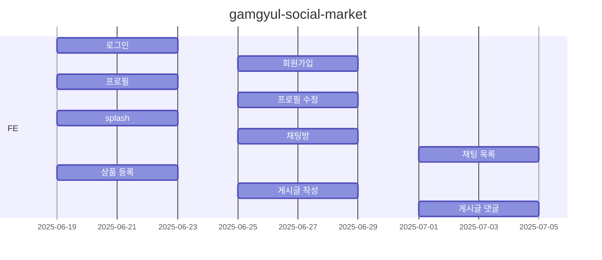

# 감귤 마켓 서비스

## 1. 목표와 기능
### 1.1 목표
- 감귤마켓 서비스
  - 로그인
  - 회원가입
  - 프로필
  - 상품
  - 채팅

### 1.2 기능
- 로그인
- 회원가입
- 프로필
- 팔로워, 팔로잉 목록
- 프로필 수정
- 상품 등록
- 게시글 댓글
- 게시글 작성
- 채팅방
- 채팅 목록
- 피드(홈 화면)
- 하단 탭 메뉴
- 좋아요 버튼
- 모달 버튼

### 1.3 팀 구성
역할 | 이름 | 담당 영역
-- | -- | --
팀장 | 김용일 | 상품 등록, 게시글 댓글 페이지, 게시글 작성 페이지
팀원 | 윤광석 | 사용자 프로필 페이지, 팔로워 / 팔로잉 목록, 내 프로필 수정
팀원 | 윤동령 | 로그인, 회원가입
팀원 | 우영기 | splash, 채팅 목록, 채팅방

## 2. 개발 환경
### 2.1 프로젝트 생성 / 실행
- git clone https://github.com/minerkyi/gamgyul-social-market
- cd gamgyul-social-market
- npm install
- npm install react-router-dom
- npm i styled-reset
- npm run dev

### 2.2 코딩 컨벤션
#### 웹 개발 코딩 컨벤션 가이드

> HTML, CSS, JavaScript의 기본적인 코딩 컨벤션을 정리한 문서입니다.

---

##### 📋 목차

- [HTML 컨벤션](#html-컨벤션)
- [CSS 컨벤션](#css-컨벤션)
- [JavaScript 컨벤션](#javascript-컨벤션)
- [주석 작성 가이드](#주석-작성-가이드)
- [파일 구조](#파일-구조)
- [추가 권장사항](#추가-권장사항)

---

##### 🌐 HTML 컨벤션

###### 📐 들여쓰기와 포맷팅
- **들여쓰기**: 2칸 공백 사용
- **태그**: 소문자로 작성
- **속성**: 소문자로 작성하고 큰따옴표로 감쌉니다
- **자체 닫힘 태그**: 슬래시 앞에 공백을 둡니다 (``)

```html
<!DOCTYPE html>
<html lang="ko">
  <head>
    <meta charset="UTF-8">
    <meta name="viewport" content="width=device-width, initial-scale=1.0">
    <title>페이지 제목</title>
  </head>
  <body>
    <header>
      <h1>메인 제목</h1>
    </header>
    <main>
      <section class="content">
        <p>내용을 작성합니다.</p>
      </section>
    </main>
  </body>
</html>
```

###### 🏷️ 속성 순서
| 순번 | 속성 |
|------|------|
| 1 | `class` |
| 2 | `id` |
| 3 | `name` |
| 4 | `data-*` |
| 5 | `src`, `for`, `type`, `href`, `value` |
| 6 | `title`, `alt` |
| 7 | `role`, `aria-*` |

---

##### 🎨 CSS 컨벤션

###### 📐 들여쓰기와 포맷팅
- **들여쓰기**: 2칸 공백 사용
- **중괄호**: 같은 줄에 여는 중괄호, 새 줄에 닫는 중괄호
- **세미콜론**: 모든 선언 끝에 세미콜론 추가
- **공백**: 콜론 뒤에 한 칸 공백

###### 🏷️ 네이밍 컨벤션
| 타입 | 컨벤션 | 예시 |
|------|--------|------|
| 클래스명 | kebab-case | `main-header`, `nav-item` |
| ID | camelCase 또는 kebab-case | `userId`, `user-id` |
| 의미있는 이름 | 목적 기반 네이밍 | ✅ `navigation-menu` ❌ `red-text` |

###### 📋 속성 순서
| 순번 | 카테고리 | 속성 |
|------|----------|------|
| 1 | 레이아웃 | `display`, `position`, `top`, `right`, `bottom`, `left` |
| 2 | 박스 모델 | `width`, `height`, `margin`, `padding` |
| 3 | 배경 | `background`, `border` |
| 4 | 텍스트 | `font`, `text-align`, `color` |
| 5 | 기타 | `opacity`, `cursor` |

###### 📏 단위 사용
- ❌ `0` 값에는 단위를 붙이지 않습니다
- ✅ 소수점이 0인 경우 생략합니다 (`.5s` → `0.5s`는 `500ms`로)
- 🎯 상대 단위(`rem`, `em`, `%`)를 우선적으로 사용

---

##### ⚡ JavaScript 컨벤션

###### 📐 들여쓰기와 포맷팅
- **들여쓰기**: 2칸 공백 사용
- **세미콜론**: 문장 끝에 항상 추가
- **중괄호**: 같은 줄에 여는 중괄호 (K&R 스타일)
- **공백**: 키워드와 괄호 사이, 연산자 앞뒤에 공백

###### 🔧 변수 선언
| 키워드 | 사용 목적 |
|--------|-----------|
| `const` | 재할당하지 않는 변수 |
| `let` | 재할당이 필요한 변수 |
| `var` | ❌ 사용하지 않습니다 |

###### 🏷️ 네이밍 컨벤션
| 타입 | 컨벤션 | 예시 |
|------|--------|------|
| 변수/함수 | camelCase | `userName`, `getData` |
| 상수 | UPPER_SNAKE_CASE | `MAX_RETRY_COUNT` |
| 클래스 | PascalCase | `UserManager` |
| private 멤버 | 앞에 언더스코어 | `_privateMethod` |

###### 🔄 함수 작성
| 타입 | 사용 목적 |
|------|-----------|
| 화살표 함수 | 간단한 함수에 사용 |
| 함수 선언 | 호이스팅이 필요한 경우 |
| 매개변수 객체 | 3개를 초과하는 매개변수 |

###### 📦 객체와 배열
- ✅ **구조 분해 할당** 적극 활용
- ✅ **스프레드 연산자** 사용
- ✅ **단축 속성명** 사용

###### ⚠️ 에러 처리
- `try-catch` 블록 사용
- 의미있는 에러 메시지 작성
- 에러 로깅 필수

---

##### 💬 주석 작성 가이드

###### HTML 주석
```html
<!-- 메인 네비게이션 영역 -->
<nav class="main-navigation">
  <!-- 로고 -->
  <div class="logo">...</div>
  
  <!-- 메뉴 항목들 -->
  <ul class="menu-items">...</ul>
</nav>
```

###### CSS 주석
```css
/* ==========================================================================
   Header Styles
   ========================================================================== */

.header {
  /* 고정 헤더를 위한 z-index 설정 */
  z-index: 1000;
}

/* TODO: 반응형 디자인 개선 필요 */
.sidebar { }
```

###### JavaScript 주석
```javascript
/**
 * 사용자 데이터를 처리하는 함수
 * @param {Object} userData - 사용자 정보 객체
 * @param {string} userData.name - 사용자 이름
 * @param {string} userData.email - 사용자 이메일
 * @returns {Object} 처리된 사용자 정보
 */
function processUserData(userData) {
  // 이메일 유효성 검사
  if (!isValidEmail(userData.email)) {
    throw new Error('유효하지 않은 이메일 형식');
  }
  
  return {
    ...userData,
    processed: true,
    timestamp: Date.now()
  };
}
```

### 2.1 배포 URL
- <https://github.com/minerkyi/gamgyul-social-market>
- <https://minerkyi.github.io/gamgyul-social-market/>
- 테스트용 계정
  ```
  id : 
  pw : 
  ```
  
### 2.2 연동 API
- [API 명세](https://www.notion.so/oreumi/API-19debaa8982b8129aaa9f8c4678447ac)
- 요청 URL: <https://dev.wenivops.co.kr/services/mandarin>

  | URL                          | Note                            |
  |------------------------------|---------------------------------|
  | /user/login                  | 로그인                           |  

## 3. 요구사항 명세와 기능 명세
- 

## 4. 프로젝트 구조와 개발 일정

### 4.1 프로젝트 구조
```
gamgyul-social-market
├─ src
│  ├─ componets
│  │  └─ Sample1.jsx
│  ├─ contexts
│  ├─ hooks
│  └─ pages
├─ index.html
├─ package.json
├─ package-lock.json
├─ eslint.config.js
├─ vite.config.js
├─ .gitignore
└─ README.md
```
### 4.2 개발 일정


 ## 5. 화면 설계
 | 로그인  | 회원가입  |
 |----------|-----------|
 |   |   |

## 6. 메인 기능
- 로그인

## 7. 개발하며 느낀점
- 
